# 👋 Hi, I'm Ashwith D

<p align="center">
  
</p>

<!-- <p align="center">
  <a href="https://github.com/AshwithD">
    
  </a>
  <a href="https://github.com/AshwithD?tab=followers">
    
  </a>
</p> -->

---

## 🧑‍💻 About Me

```python
class Ashwith:

    role = "Backend Developer"
    education = "B.E. Electronics & Communication Engineering"
    graduation = 2025

    focus = [
        "Backend Development",
        "REST APIs",
        "Database Design",
        "Authentication & Security",
        "System Design"
    ]

    currently_learning = [
        "FastAPI",
        "PostgreSQL",
        "System Design",
        "API Security",
        "React"
    ]
```

> 🚀 I enjoy building backend systems, APIs, dashboards, and automation tools that solve practical problems.

---

## ⚡ Tech Stack

### 🐍 Languages

<p>
  
</p>

### ⚙️ Backend & APIs

<p>
  
</p>

<p>
  
  
</p>

### 🎨 Frontend

<p>
  
</p>

### 🗄️ Databases & Tools

<p>
  
</p>

<p>
  
</p>

---

## 🚀 Featured Projects

<table>
<tr>
<td width="50%" valign="top">

### 📈 Binance Futures Trading Dashboard

A Python + Streamlit dashboard for interacting with the Binance Futures Testnet.

**Highlights**

* 📊 Live market prices
* ⚡ Futures order placement
* 🎚️ Leverage control
* 💰 Margin tracking
* 📌 Position tracking
* 🐍 Python-based backend logic

**Stack**

`Python` `Streamlit` `REST API`

</td>

<td width="50%" valign="top">

### 🔗 Trade Finance Blockchain Explorer

An ongoing backend-driven trade finance workflow system simulating immutable ledger records.

**Highlights**

* 🔐 Role-based workflows
* 📄 Document management
* 🔎 Document verification
* #️⃣ Hash integrity verification
* 🧾 Ledger timeline
* 🔑 JWT authentication

**Stack**

`FastAPI` `SQLModel` `PostgreSQL` `React` `JWT`

</td>
</tr>
</table>

---

## 🧠 Currently Learning

<p align="center">


</p>

---

## 📊 GitHub Activity

<p align="center">
  
  
</p>

---

<!-- <p align="center">
## 🔥 Contribution Streak
  
</p> -->

---

## 🐍 Contribution Activity

<p align="center">
  
</p>

---

## 🎯 What I'm Working Toward

```text
Backend Engineering
       │
       ├── Python
       │    ├── FastAPI
       │    └── Django
       │
       ├── Databases
       │    ├── PostgreSQL
       │    └── SQL
       │
       ├── API Engineering
       │    ├── REST
       │    ├── JWT
       │    └── Security
       │
       └── Architecture
            └── System Design
```

---

## 📫 Let's Connect

<p align="center">

<a href="mailto:ashwithd40@gmail.com">
  
</a>

<a href="https://www.linkedin.com/in/ashwith-d-495724204">
  
</a>

<a href="https://github.com/AshwithD">
  
</a>

</p>

---

<p align="center">
  <b>⚡ Build → Break → Learn → Improve → Repeat</b>
</p>

<p align="center">
  
</p>
